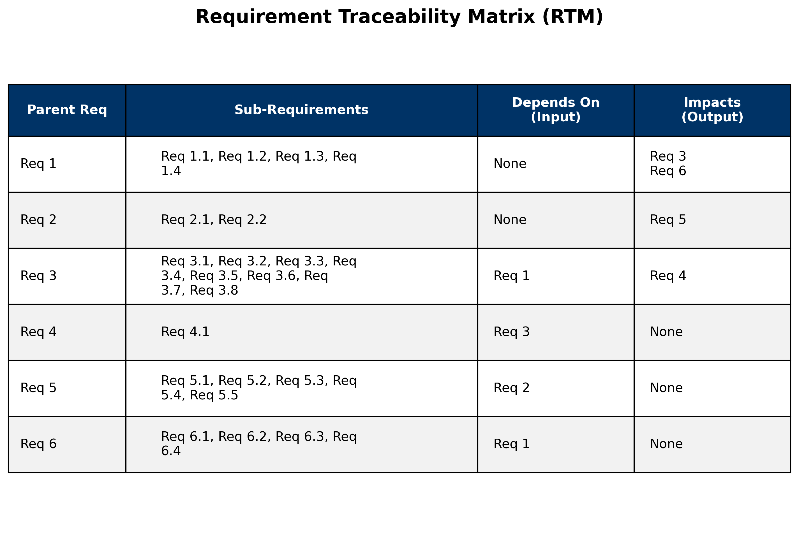
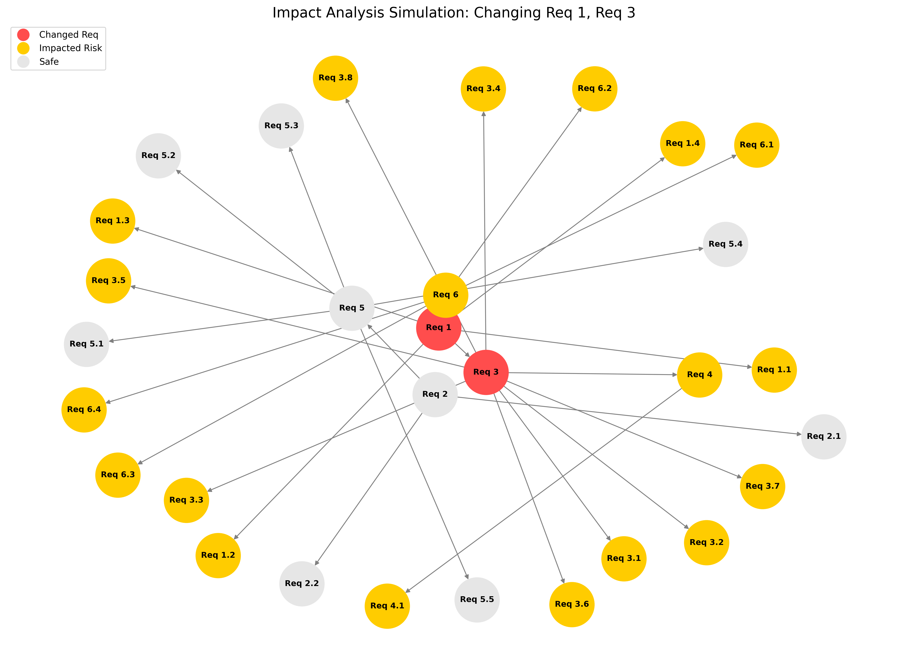

# ReqImpact-Analyzer: Automated Traceability & Impact Analysis

### **Overview**
**ReqImpact-Analyzer** is a Python-based tool designed to automate the visualization of `Requirement Traceability Matrices (RTM)` and simulate the `Blast Radius` of potential changes in a project. 

As a Business Analyst, managing requirements is not just about documenting them, it is about understanding their relationships. When a stakeholder asks to change "just one small thing," it rarely impacts only that one thing. This tool uses `Directed Acyclic Graphs (DAGs)` to mathematically map dependencies and visualize the systemic risk of scope changes.

---

### **The Business Problem**
In complex projects, requirements are interconnected.
1.  **Derivation:** High-level business needs break down into smaller functional requirements (Parent $\to$ Child).
2.  **Dependency:** Feature A cannot function without Feature B (Provider $\to$ Consumer).

Managing these links in Excel is manual, static, and error-prone. If a root requirement changes, it is difficult to instantly identify every downstream functional requirement that is now at risk.

### **The Solution**
This tool ingests a set of raw requirements and relationships to generate two key artifacts:

#### **1. The Hierarchical Traceability Matrix (RTM)**
A clean, table-based view that organizes requirements by their Parent ID. It instantly answers:
* *What specific functional items make up this requirement?* (Children)
* *What inputs does this requirement need?* (Upstream Dependencies)
* *Who will break if this requirement fails?* (Downstream Impacts)

#### **2. The Impact Analysis Simulator**
A visual network graph that simulates a "Change Request."
* **Scenario:** We simulate a change to **Req 1** and **Req 3**.
* **Logic:** The algorithm traverses the graph to find every node connected downstream from these changes.
* **Visuals:**
    * 🔴 **Red Nodes:** The requirements being changed.
    * 🟠 **Orange Nodes:** The "Blast Radius" (requirements at risk).
    * ⚪ **Grey Nodes:** Unaffected requirements.

---

### **Case Study: The Logic Behind the Data**
For this simulation, we used a specific set of 6 parent requirements with the following rules:

* **The Hierarchy:**
    * Req 1 $\to$ breaks down into 1.1, 1.2, 1.3, 1.4
    * Req 3 $\to$ breaks down into 3.1 through 3.8
* **The Dependencies:**
    * **Req 3 depends on Req 1** (If Req 1 changes, Req 3 is at risk).
    * **Req 4 depends on Req 3** (The chain reaction continues).

#### **Analysis of the Results**
When we run the simulation for a change in **Req 1** and **Req 3**:
1.  **Direct Impact:** All sub-requirements (1.1–1.4 and 3.1–3.8) turn **Orange**. This is expected; if the parent changes, the children must be reviewed.
2.  **Second-Order Impact:** **Req 4** turns **Orange**. Even though we didn't touch Req 4, it relies on Req 3. Since Req 3 changed, Req 4 is now unstable.
3.  **Third-Order Impact:** **Req 6** turns **Orange**. It has a dependency on Req 1.

**Conclusion of Simulation:** A request to change 2 items actually impacts **over 15 items** across the system.

---

## 🛠️ Tech Stack
This project was built using **Python 3.x** and leverages the following libraries to handle graph theory and data visualization:

* `NetworkX:` Used to construct the `Directed Acyclic Graph (DAG)` and perform the "descendant traversal" algorithm to calculate the impact blast radius.
* `Matplotlib:` Used to render both the structured Traceability Table and the Force-Directed Network Graph.
* `Pandas:` Used to organize the requirement data into structured DataFrames for easy manipulation and tabular display.
