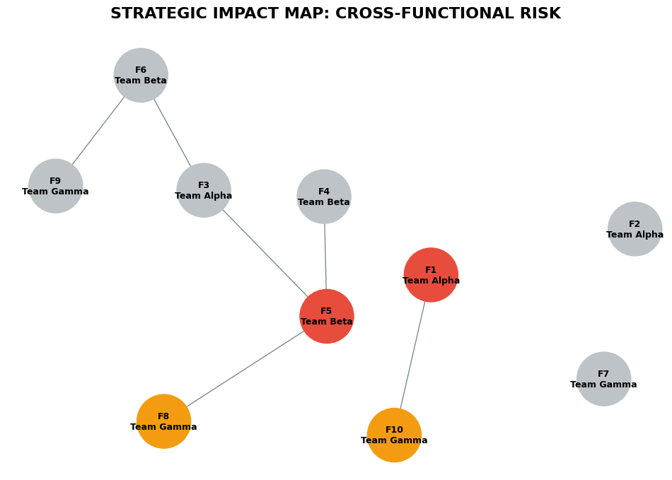
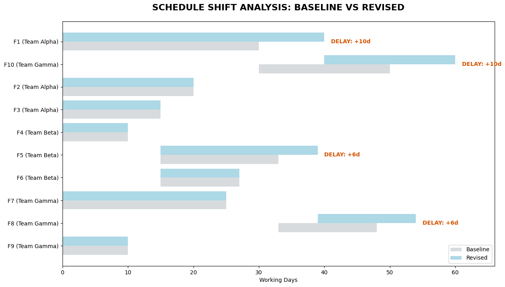

# Strategic Delivery Governance Framework: Cross-Functional Impact Analyzer

### **Project Overview**
"Small" stakeholder change requests often trigger a wave of delays across the portfolio. This project provides a data-driven governance engine to quantify the ripple effect of scope changes. By mapping interdependencies and recalculating delivery timelines in real-time, it bridges the gap between executive decision-making and operational reality.

---

### **The Value Proposition**
A data-driven governance engine designed to quantify the ripple effect of scope changes across multi-team dependencies and visualize resulting delivery delays.

---

### **The Challenge: The "Invisible" Delivery Risk**
Standard project tracking often fails to account for how a delay in one team’s "Root Feature" impacts another team’s "Downstream Delivery." When Team Alpha increases effort by 10 days, Team Gamma—who hasn't changed their scope at all—may find their finish line pushed back by two weeks due to a hidden dependency. 

### **The Solution: Analytical Oversight**
This framework consumes raw feature registries and dependency maps to produce two critical perspectives:
1. **Organizational Alignment:** Identifying which teams (Alpha, Beta, Gamma) must collaborate to accommodate a change.
2. **Temporal Impact:** Quantifying exactly how many days the project end-date will shift across the entire feature set.

---

### **Analytical Outputs**

#### **1. Operational Impact Map**
This visualization identifies the "Blast Radius" of a change request. It allows leadership to see which teams are impacted by a scope change, even if they aren't the primary owners of the feature being updated.

* **Change Triggers (Red):** Features directly targeted by stakeholder requests (F1, F5).
* **Indirect Impacts (Orange):** Features forced into a delay due to architectural or delivery dependencies (F8, F10).
* **Cross-Functional Awareness:** Labels identify team ownership, highlighting where inter-team "handshakes" are required.

#### **2. Schedule Shift Analysis**
A side-by-side comparison of the project’s **Baseline** vs. **Revised** timeline. This chart quantifies the cost of change in units of time.

* **Critical Path Identification:** Automatically calculates new end-dates based on topological sorting of dependencies.
* **Automated Delay Callouts:** Explicitly labels the number of days each feature has slipped (e.g., "+10d delay"), providing objective data for stakeholder negotiation.

---

### **Strategic Action Plan**
Upon identifying a schedule shift, the framework enables the following governance steps:
1. **Stakeholder Negotiation:** Use the Schedule Shift Analysis to present a data-backed case for either extending the deadline or increasing resources.
2. **Cross-Functional Sync:** Initiate a "Handshake Meeting" between the Change Trigger Team and the Indirectly Impacted Team to align on new delivery windows.
3. **Critical Path Protection:** Prioritize resources for features that have the highest accumulated delay (F10) to prevent further portfolio delay.
4. **Scope Re-prioritization:** Identify "Stable" features (F2, F7) with low business value that can be de-scoped to reclaim the lost days and protect the original Go-Live date.
